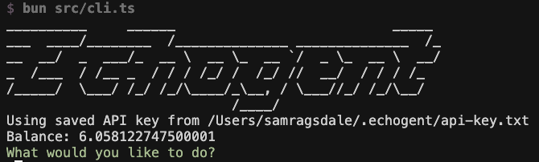

# ECHOGENT

AI coding assistant that runs in your CLI. Powered by Claude via Echo.




## Setup

```bash
bun install
bun run dev
```

On first run, you'll get an Echo API key for billing.

## Features

- Browse and read files
- Search code with ripgrep
- Interactive AI assistance
- Automatic billing via [Echo](echo.merit.systems)

Requires [Bun](https://bun.com) and ripgrep.